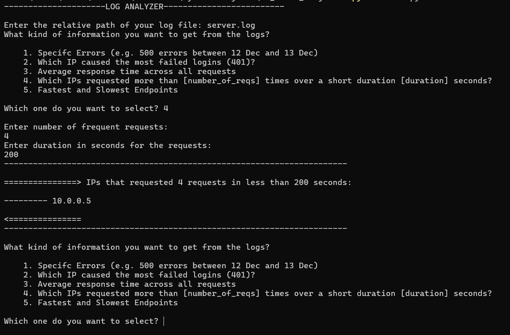

# `Log Analyzer CLI`

## What is this project ?
- This project is a basic CLI tool that analyzes log files by reading them and performing various operations on the data extracted.

### `CLI`


## What problem it solves ?
- It is a very basic version of analyzing different types of activities occurring in the application e.g. failed logins, suspicious activity, performance, etc.

## What can it do ?
- `Specific Errors (e.g. 500 errors between 12 Dec and 13 Dec)`
- `Which IP caused the most failed logins (401)?`
- `Average response time across all requests`
- `Which IPs requested more than [number_of_reqs] times over a short duration [duration] seconds?`
- `Fastest and Slowest Endpoints`

## How to run it ?
### `Requirements`
- Python version >= 3.12.0

### Clone the repo: 

1.
    ```
    git clone https://github.com/ayvkma/log-analyzer-cli.git   
    ```
2.  ```python
    python main.py
    ```


## What mistakes I made and what I learned from them ?

- I was using a overall messed up and logically incorrect solution for the 4th option, asking ChatGPT for review, I came to know it was a case for Sliding Window Algorithm, implemented the algorithm to find the window of consecutive requests within a specified duration.
- Overengineering python `datetime`, it supports a lot of features built-in, I was not using them.
- Overall, this project helped me logically and also I improved my python knowledge like opening files, working with strings, lists, datetime, sys, etc.
- By implementing the sliding window, I got a gist of how suspicious IPs are flagged.

## Possible Enhancements
- Seperation of concerns, like parsing the log file and other functionalities in seperate files or functions.
- Using LLM to drive the analysis.